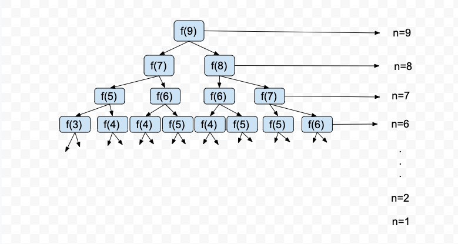

# 第一章 复杂度分析

---

数据结构和算法要解决的问题本质上就两个：**省** 和 __快__，即如何让代码更节省存储空间，以及如何让代码运行得更快。

想要提升一段代码的执行效率，就需要知道如何衡量一段代码的执行效率，那么如何衡量一段代码的执行效率呢？这就要用到两样东西：**空间、时间复杂度分析**。

复杂度分析的能力非常重要，只要掌握了空间、时间复杂度分析，那么你基本上就掌握了数据结构和算法一半内容了。

## 第一节 空间复杂度分析

空间复杂度的全称是**渐进空间复杂度（asymptotic space complexity），表示算法的存储空间和数据规模之间的增长关系**。

我们以下面三段代码作为例子：

    // 方法1，给传入的值n加1之后返回，其中n>=0
    public int addOne(int n) {
        int r = n + 1;
        return r;
    }
    
    // 方法2，根据传入值n初始化一个大小为n的数组，其中n>=0
    public int[] createArray(int n) {
       int[] ints = new int[n];
       return ints;
    }
    
    // 方法3，根据传入值n初始化一个大小为n x n的二维数组，其中n>=0
    public int[][] create2DArray(int n) {
       int[][] board = new int[n][n];
       return board;
    }

在 **方法1** 中，我们初始化了一个局部变量 __r__,它是一个 **int**类型的值，占用4个字节的存储空间。也就是说，在执行这个方法的时候，每次都需要额外申请4个字节的存储空间来存储局部变量 **r**。

在 **方法2** 中，我们初始化了一个局部变量 __ints__,它是一个 **int**类型的数组，
数组的大小是 __n__，数组中每个元素占用4个字节的存储空间。也就是说，在执行这个方法的时候，每次都需要额外申请 **n x 4** 个字节的存储空间来存储局部变量 **ints** 。

在 **方法3** 中，我们初始化了一个局部变量 __board__,它是一个 **int**类型的二维数组，数组的大小是 __n x n__，二维数组中每个元素占用4个字节的存储空间。也就是说，在执行这个方法的时候，每次都需要额外申请 **n x n x 4** 个字节的存储空间来存储局部变量 **board** 。

我们把这个额外申请的存储空间大小用**S** 来表示，那么
>在 **方法1** 中，S = 4;
>
>在 **方法2** 中，S = n x 4 = 4n。
>
>在 **方法3** 中，S = n x n x 4 = 4n2。

显然：

在 **方法1** 中，无论 __n__ 多大，额外需要的存储空间都是4个字节，是一个常量。

在 **方法2** 中，随着 **n** 变大，额外需要的存储空间会变多，是4n个字节，是一个线性增长函数。

在 **方法3** 中，随着 **n** 变大，额外需要的存储空间会变更多，是4n2个字节，是一个平方增长函数。

在分析算法复杂度的时候，通常都用大写的 **O** 来表示随着数据规模的增长，额外需要的存储空间的增长趋势，以及代码运行所需时间的增长趋势。这就是 __大O复杂度表示法__ 。

如果用 __大O复杂度表示法__ 表示上面三个方法的空间复杂度的话，那么
>在 **方法1** 中，因为额外需要的存储空间是一个常量，所以空间复杂度为 __O(1)__。
>
>在 **方法2** 中，因为额外需要的存储空间是一个线性增长函数，所以空间复杂度为 __O(n)__。
>
>在 **方法3** 中，因为额外需要的存储空间是一个平方增长函数，所以空间复杂度为 __O(n2)__。

因为 __大O复杂度表示法__ 表示的是代码所需的存储空间和运行时间随着数据规模增长的变化趋势，所以当我们使用 **大O复杂度表示法** 表达复杂度时，会忽略公式中的 **低阶、常量、系数** ，只记录一个最大的量级。比如在上面的代码中，我们就省略了 **方法2** 和 **方法3** 中的系数4，同时 **方法1** 中的 **常量4** 也使用 **1** 来表示。

再以下面的这段代码为例

    // 方法4
    public void justADemo(int n) {
        int r = n + 1;
        int[][] board = new int[r][r];
    }

为了方便演示，在**方法4**中， 我综合了 __方法1__ 和 **方法3** 的代码，那它额外需要的存储空间是多少呢？

根据之前的计算可知，变量 r 所需的额外空间是4个字节；变量 __board__ 所需的额外空间是 **r x r x 4**，将 __r__ 换算成 **n + 1** 就是
>(n+1) x (n+1) x 4 = (n2 + 2n + 1) x 4 = 4n2 + 8n + 4

如果用 __大O复杂度表示法__ 来表示这个方法的空间复杂度，那么结果会和 **方法3** 一样，也是 __O(n2)__。因为 **低阶8n、常量4和系数4** 都会被忽略掉。

之所以忽略 **低阶、常量、系数**， 是因为当数据规模越来越大时，低阶、常量、系数对复杂度的影响会越来越小。比如在方法4的公式中，随着n从1增长到100、1000、10000、1000000时，低阶8n在4n2 + 8n + 4中所占的比重就越来越小，以至于可以忽略不计。

## 第二节 时间复杂度分析

时间复杂度的全称是 **渐进时间复杂度（asymptotic time complexity），表示算法的执行时间与数据规模之间的增长关系**。

我们以下面三段代码为例

    1  // 方法5，给传入的值n加1之后返回
    2  public int addTwo(int n) {
    3      int sum = n + 2;
    4      return sum;
    5  }
    6
    7  // 方法6，从1加到n，并返回最后的和
    8  public int sumN(int n) {
    9      int sum = 0;
    10     for (int i = 1; i <= n; ++i) {
    11         sum += i;
    12     }
    13     return sum;
    14 }
    15 // 方法7，从1*1、1*2……一直加到n*n，并返回最后的和。
    16 public int sum2DN(int n) {
    17     int sum = 0;
    18     for (int i = 1; i <= n; ++i) {
    19         for (int j = 1; j <= n; ++j) {
    20             sum += i * j;
    21         }
    22     }
    23     return sum;
    24 }

虽然每一行代码执行完成一次所需的实际时间并不一样，但为了方便计算，我们假设每一行代码执行完成一次所需的时间是一样的，都是1ns(纳秒)，那么

在执行**方法5**时，需要执行第3、4行代码各1次，即执行完成总共需要 **2** 纳秒的时间；

在执行**方法6**时，需要执行第9、13行代码各1次，第10、11两行代码各n次，即执行完成总共需要 **2 + 2n** 纳秒的时间。

在执行**方法7**时，需要执行第17、23行代码各1次，第18行代码n次，第19、20行代码各n x n次，即执行完成总共需要 **2 + n + 2 x n x n** 纳秒。

我们把一段代码总的执行时间用 **T** 来表示，那么
>在 **方法5** 中，T = 2;
>
>在 **方法6** 中，T = 2 x n = 2n。
>
>在 **方法7** 中，T = 2 + n + 2 x n x n = 2n2 + n + 2。

如果用 __大O复杂度表示法__ 表示上面三个方法的时间复杂度，忽略**低阶、常量、系数**之后，那么
>因为 **方法5** 执行完成总共需要 **2** 纳秒的时间, 是一个常量，所以时间复杂度为 __O(1)__。
>
>因为 **方法6** 执行完成总共需要 **2n** 纳秒的时间, 是一个线性增长函数，所以时间复杂度为 __O(n)__。
>
>因为 **方法7** 执行完成总共需要 **2n2 + n + 2** 纳秒的时间，是一个平方增长函数，所以时间复杂度为 __O(n2)__。

从**方法7**的时间复杂度可以看出，一段代码的时间复杂度，往往取决于循环执行次数最多的那些代码行。因此，在分析一段代码的时间复杂度时，我们通常只要分析执行次数最多的代码行就够了。

## 第三节 如何用复杂度分析改进算法

下面是一个利用**时间、空间复杂度分析**改进算法的例子，求**斐波那契数列**。

**斐波那契数列** 的特性是：除了第1个数默认为0，第2个数默认为1，从第3个数到第n个数，
都为前两个数的和。比如

>第3个数是第1个数与第2个数的和，也就是0 + 1 = 1；
>
>第4个数是第2个数与第3个数的和，也就是1 + 1 = 2；
>
>第5个数是第3个数与第4个数的和，也就是1 + 2 = 3；
>
>第6个数是第4个数与第5个数的和，也就是2 + 3 = 5；

写成数列的形式，就是：**0、1、1、2、3、5、8、13、21……**

现在我们要写一个方法，这个方法的输入参数是正整数n(n >= 1)，返回值是**斐波那契数列**中的第n个数。

针对这个问题，最容易想到的实现方式就是使用递归，递归实现的代码如下

    // 方法8
    public long fibonacciNo1(long n) {
        if (n < 1) return 0; 
        if (n == 1 || n == 2) return n - 1;
        return fibonacciNo1(n - 2) + fibonacciNo1(n - 1);
    }

方法8的代码很简洁、也很清晰，那么它是好的算法吗？要解答这个问题，我们需要分析它的**空间、时间复杂度**。

先说**空间复杂度**，在方法8中，我们只在执行最后一行做加法的代码时，需要申请一个long类型的临时存储空间，即8个字节，是一个常量，所以**空间复杂度为O(1)**。显然，在**空间复杂度**上，**方法8**做到了最好。

再看**时间复杂度**，递归算法的时间复杂度不是很好分析，需要借助画图。假设n=9，求f(9)，那么方法8的执行过程如下图

从上图的递归树中，我们可以看到：树的深度每增加一层，**方法8**被执行的次数就翻一倍，树的深度为n。当n=9时，**方法8**总的执行次数为：
>**20 + 21 + 22 + 23 + 24 + 25 + 26 + 27 + 28 = 29 - 1 = 511**;

根据上面的计算结果，将9换回n，那么当输入值为n时，**方法8**在递归树中被执行的次数为2n - 1，忽略常量-1之后，**方法8**的**时间复杂度为O(2n)**。

很明显，**方法8的时间复杂度非常高，是指数级别的**。（根据我在自己电脑上的测试结果，当n=50时，方法8执行完成需要50秒左右；当n=60时，方法8执行完成需要大概1天时间；当n>100时，全世界绝大多数电脑根本计算不出结果来，因为需要的时间太长了，远远超过电脑本身的可用寿命）

之所以**方法8**的时间复杂度是指数级别的，是因为它做了很多重复计算，从上图的递归树中，我们一眼就能看出：f(7)、f(6)、f(5)、f(4)……都被重复计算了多次。也就是说，**方法8**做了太多的无用功，要改进它，我们首先需要去除这些重复计算，那么怎么去除呢？

最容易想到的方法就是做**备忘录**，即将第1次计算出来的结果保存起来，比如将f(4)的计算结果保存起来，当再次需要f(4)的计算结果时，就可以直接从备忘录中取，而不用重新计算了。

增加了备忘录之后的代码如下

    // 方法9
    public long fibonacciNo2(long n, Map<Long,Long> memo) {
        if (n < 1) return 0; 
        if (n == 1 || n == 2) return n - 1;
        Long r = memo.get(n);
        if (null == r) {
            r = fibonacciNo2(n - 2,memo) + fibonacciNo2(n - 1,memo);
            memo.put(n,r);
        }
        return r;
    }

因为增加了Map<Long,Long> memo这个备忘录，备忘录中保存n个斐波那契数列中的数，所以**方法9的空间复杂度为O(n)**；相比于**方法8，方法9**的空间复杂度变高了。

于此同时，因为有了备忘录，每一个斐波那契数列中的数都只需计算一次，因而**方法9的时间复杂度大大降低了，从指数级增长的O(2n)降低为线性增长的O(n)**。

那**方法9**是否足够好了呢？答案时，仍然不够好，因为相对于**方法8**，**方法9**的空间复杂度提高了。

事实上，**方法9**中的备忘录做了一些无用功，为了求第n个斐波那契数列中的数，它保存了从第1、第2、一直到第n-1共n-1个数，但我们其实只需要保存第n-2和第n-1两个数就可以了。

改进备忘录之后的代码如下：

    // 方法10, 调用示例：fibonacciNo3(9,0,1);
    public long fibonacciNo3(long n, long preTwo, long preOne) {
        if (n < 1) return 0; 
        if (n == 1 || n == 2) return n - 1;
        if (n == 3) return preTwo + preOne;
        return fibonacciNo3(n-1, preOne, preTwo + preOne);
    }

**方法10**的时间复杂度和**方法9**一样，是O(n)；但空间复杂度降低了，是O(1)，因为相对于**方法9**，**方法10**只增加了2个额外的long值存储空间（16个字节）来保存变**preTwo**和**preOne**,是一个常量。

到此为止，我们已经将求**斐波那契数列**的算法的时间复杂度和空间复杂度都降到理论上的最低，然而事情还没完。

如果你运行**方法10**，随着n的增大，你很快就会遇到一个问题——**栈空间溢出**。因为n每增加1，**方法10**的递归调用栈深度就增加1层，而栈空间的深度是有限的，基本上超过1000层之后，栈空间随时都可能产生溢出。

事实上，用递归来实现求**斐波那契数列**并不合适，应该改为循环来实现，改造后的代码如下

    // 方法11
    public long fibonacciNo4(long n) {
        if (n < 1) return 0; 
        if (n == 1 || n == 2) return n - 1;
        long preTwo = 0;
        long preOne = 1;
        long result = preTwo + preOne;
        for (long i = 4; i <= n; ++i) {
            preTwo = preOne;
            preOne = result;
            result = preTwo + preOne;
        }
        return result;
    }

**方法11**和**方法10**一样，空间复杂度是O(1)，时间复杂度O(n)，但没有了栈空间溢出的问题。

从理论上说，**方法11**已经没有什么问题了，但从实际上来讲，受限于long类型能够表达的数字范围，**方法11**仍然不够完美。但这个很好解决，只要将**方法11**中的long类型改为BigInteger就可以了。

至此，求**斐波那契数列**的算法就优化完了。从这多次的优化过程中，大家应该可以体会到文章开头那句话的含义了，**数据结构和算法要解决的问题本质上就两个：省 和 快，即如何让代码更节省存储空间，以及如何让代码运行得更快**。

在今后的日常开发中，希望大家能够利用在本文中学到的知识，不断优化自己写的代码，
让代码运行起来时，既节省空间，又跑得飞快。
